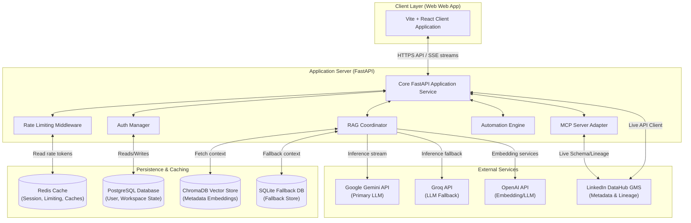
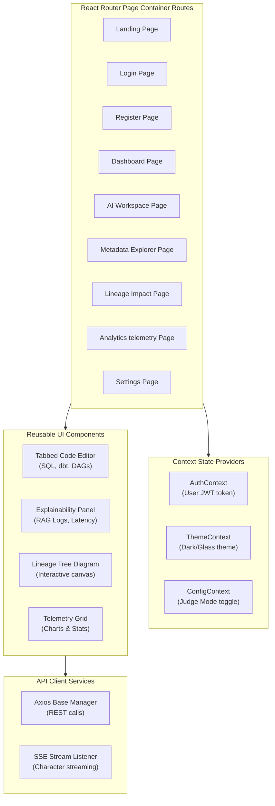
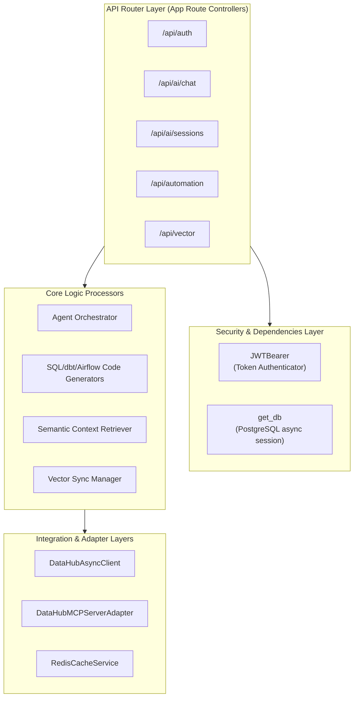
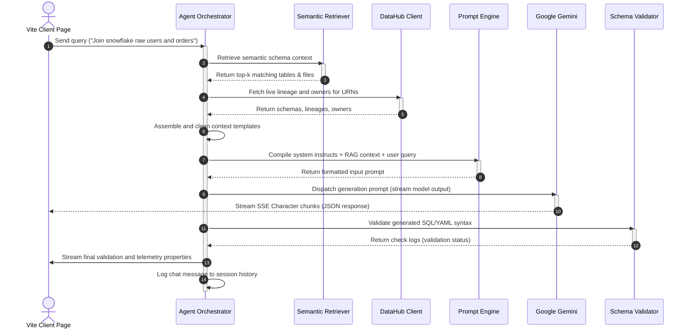
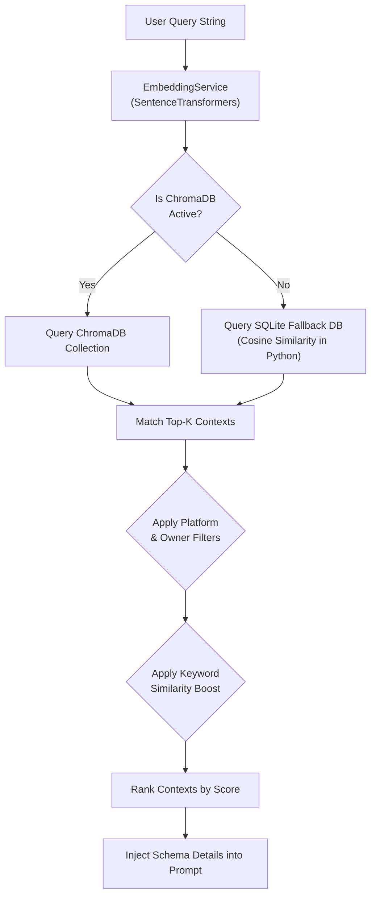
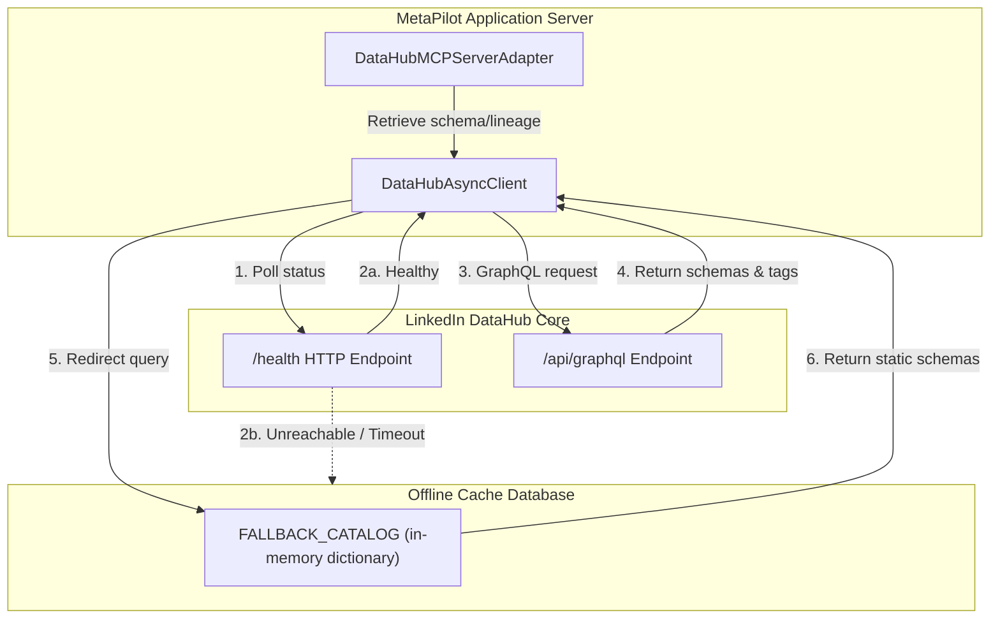
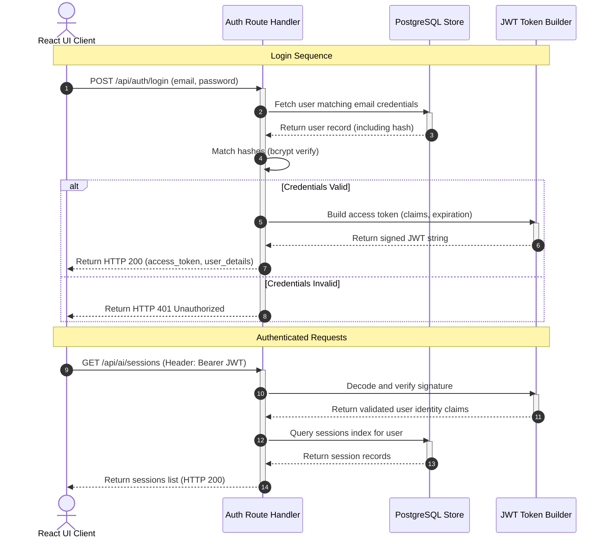
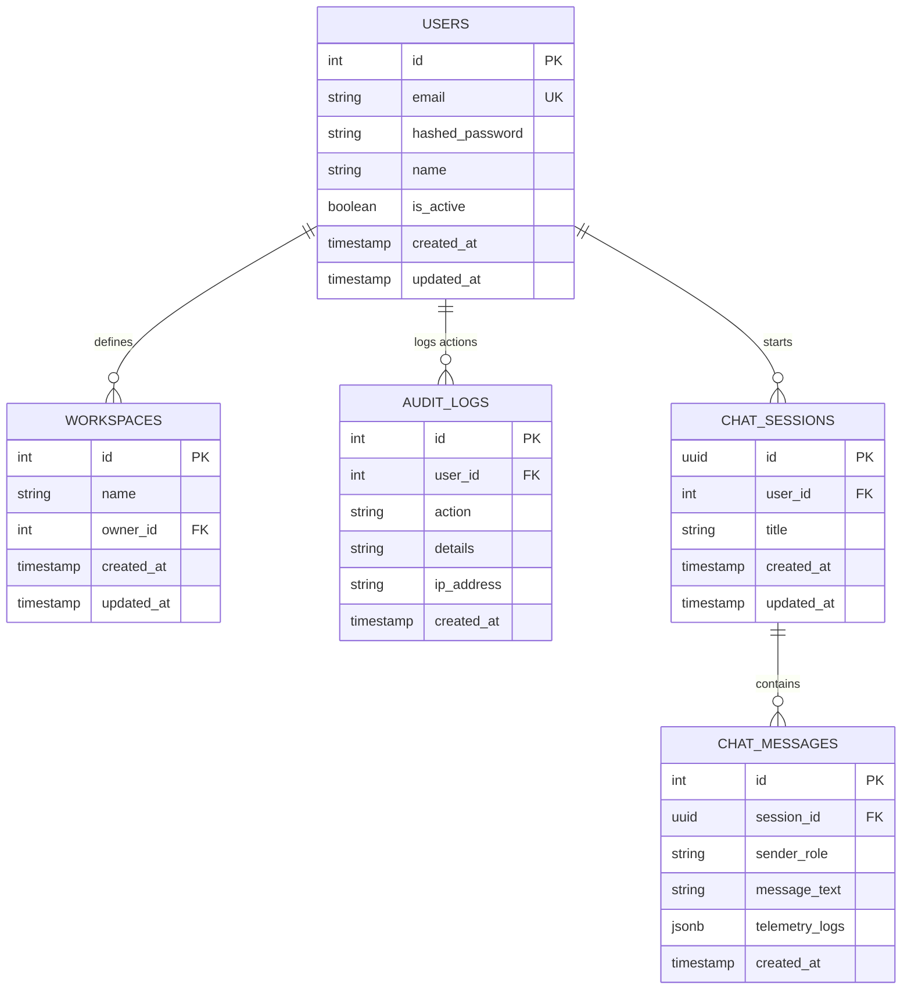
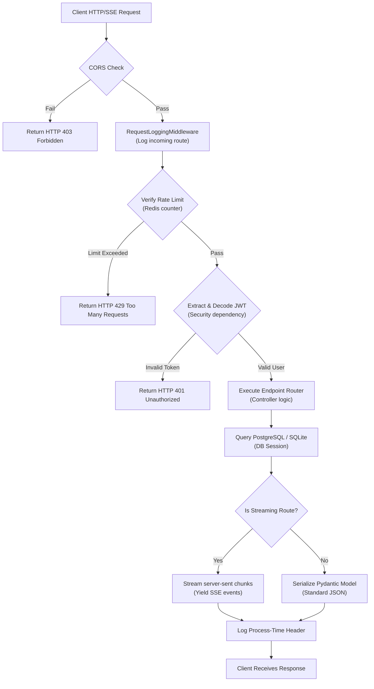

# MetaPilot Technical Architecture Specification

This document provides a deep-dive specification of the MetaPilot technical architecture. It covers the overall system design, component-level layouts, data storage schemas, pipelines, authentication protocols, and request lifecycles.

---

## Table of Contents
1. [Overall System Architecture](#1-overall-system-architecture)
2. [Frontend Client Architecture](#2-frontend-client-architecture)
3. [Backend Service Architecture](#3-backend-service-architecture)
4. [AI Agent Pipeline](#4-ai-agent-pipeline)
5. [RAG Pipeline Architecture](#5-rag-pipeline-architecture)
6. [DataHub Integration Topology](#6-datahub-integration-topology)
7. [Authentication Protocol Flow](#7-authentication-protocol-flow)
8. [Database ER Schema](#8-database-er-schema)
9. [HTTP Request/Response Lifecycle](#9-http-requestresponse-lifecycle)
10. [Deployment Architecture](#10-deployment-architecture)

---

## 1. Overall System Architecture

The overall system architecture demonstrates how the React user interface, FastAPI backend, core caching structures, metadata catalog registries, and LLM APIs interact.



---

## 2. Frontend Client Architecture

The React frontend utilizes a modular structure consisting of routers, page containers, reusable components, context providers, and customized api wrapper modules.



---

## 3. Backend Service Architecture

The backend consists of FastAPI endpoints protected by authorization dependencies, processing logic in core modules, and integration with the vector indexer and schema clients.



---

## 4. AI Agent Pipeline

This sequence traces the agentic pipeline execution steps when a user inputs a natural language query in the MetaPilot Workspace.



---

## 5. RAG Pipeline Architecture

MetaPilot's RAG pipeline operates on a fallback model to ensure robustness in diverse development and deployment environments.



---

## 6. DataHub Integration Topology

This shows how MetaPilot connects to DataHub Core GMS (GraphQL and REST) to gather metadata, falling back to mock files when offline.



---

## 7. Authentication Protocol Flow

A secure authentication sequence, mapping credential verification, database queries, and signed JWT token exchanges.



---

## 8. Database ER Schema

The database diagram mappings showing connections between users, workspace definitions, audit logs, and conversation logs.



---

## 9. HTTP Request/Response Lifecycle

The request execution path highlighting rate limits, logging interceptors, authorization checkpoints, execution threads, and server-sent event loops.



---

## 10. Deployment Architecture

The physical multi-node hosting map for production distributions, indicating Secure Sockets (SSL), proxies, container servers, and database nodes.

```mermaid
graph TD
    subgraph PublicInternet ["Public Internet Services"]
        DNS["DNS Router\n(Domain settings)"]
        User["User Browser Session"]
    end

    subgraph VercelCDN ["Vercel Edge Platform"]
        VEdge["Vercel Global CDN"]
        ReactApp["React / TS Assets\n(Static Bundle)"]
    end

    subgraph RenderPlatform ["Render Cloud Hosting"]
        Proxy["Render Load Balancer & SSL\n(Nginx Gateway)"]
        FastAPIContainer["FastAPI Docker Instance\n(Python API Server)"]
    end

    subgraph ManagedDB ["Managed Database Platforms"]
        CloudPostgres[("AWS RDS / Render DB\n(PostgreSQL Server)")]
        UpstashRedis[("Upstash Redis\n(Cache Instance)")]
    end

    %% Network flows
    User -->|1. Request app| DNS
    DNS -->|2. Resolve React app| VEdge
    VEdge -->|3. Stream assets| ReactApp
    ReactApp -->|4. Return page| User
    
    User -->|5. Secure API call (HTTPS/SSE)| Proxy
    Proxy -->|6. Reverse proxy| FastAPIContainer
    
    FastAPIContainer <-->|7. DB session| CloudPostgres
    FastAPIContainer <-->|8. Cache session| UpstashRedis
```
