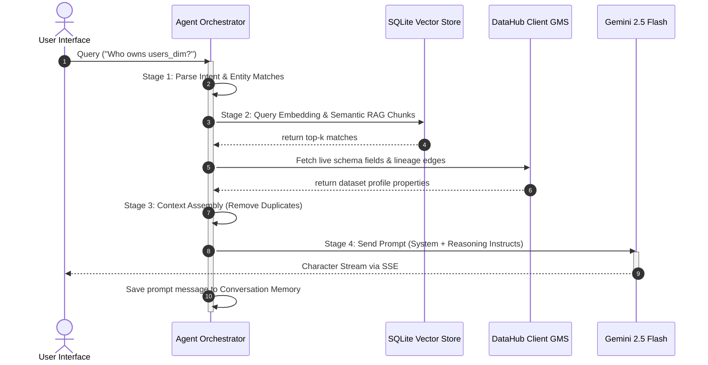

# MetaPilot Phase 4 - Agentic AI Layer Architecture & Developer Guide

This document describes the architectural specifications, prompt templates, vector indexing caches, and execution sequence diagrams for the flagship Agentic AI Layer of MetaPilot.

---

## 1. Multi-Stage Agent Pipeline Flow



---

## 2. LLM Provider Interface Mappings

```python
class BaseLLMProvider(ABC):
    @abstractmethod
    async def generate_stream(self, prompt: str, system_instruction: Optional[str] = None) -> AsyncGenerator[str, None]:
        pass

    @abstractmethod
    async def get_embedding(self, text: str) -> List[float]:
        pass
```
- **Gemini 2.5 Flash** (Primary): utilizes async HTTPX client streaming JSON content chunks.
- **Groq** (Fallback): OpenAI-compatible completion calls.
- **OpenAI** (Optional): GPT models and semantic embeddings.

If API keys are missing, providers fall back to **Offline Reasoning Simulation Mode** character-by-character, explaining metadata fields and URN dependency coordinates dynamically.

---

## 3. SQLite Vector Store RAG Pipeline

Because standard C-based packages (like `chromadb` or `sentence-transformers`) can be highly unstable to compile across different platforms, MetaPilot utilizes an in-memory/file-backed **SQLite Vector Registry**:

- **Database Path**: `vector_store.db`
- **Retrieval Math**: Cosine similarity calculations executed in Python:
  $$\text{Similarity} = \frac{A \cdot B}{\|A\| \|B\|}$$
- **Indexing Worker**: Runs automatically at FastAPI startup hook `seed_vector_index()`, vectorizing active catalog dataset schemas.

---

## 4. Prompt Engineering Guide

Templates are managed in `backend/app/ai/prompts/templates.py`:

- **System Instruction**: Enforces no hallucinations, strict source URN attribution, and step-by-step reasoning layouts.
- **Reasoning Template**: Integrates user prompt queries with dynamic structured contexts retrieved from registries.

---

## 5. Session Memory Registries

- **File Path**: `backend/app/ai/memory/session.py`
- Stores list messages, pinned flags, and summaries.
- Cleared via `DELETE /api/ai/chat/{session_id}` calls.
