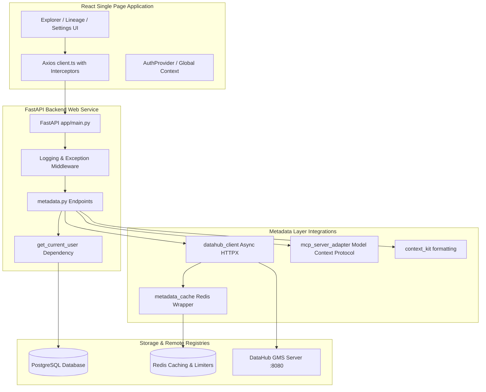

# MetaPilot Phase 3 - Architecture & Developer Setup Guide

This document describes the architectural specifications, environment configurations, and setup procedures for the Metadata Intelligence Layer of MetaPilot.

---

## 1. System Architecture Diagram



---

## 2. Technical Stack Mappings

- **DataHub Client**: Asynchronous custom HTTPX client querying GMS GraphQL/REST endpoints.
- **Cache Engine**: Redis-backed serialized JSON payload caching. Expiry maps to `METADATA_CACHE_TTL_SECS`.
- **Database Engine**: PostgreSQL managed via SQLAlchemy 2.0 async sessions and Alembic migration scripts.
- **Model Context Protocol (MCP)**: Adapter wrapper listing resource paths and execute operations against registry tools.

---

## 3. Local Development Setup Mappings

### Prerequisites
- Docker & Docker Compose (v5.3+)
- Python 3.12+
- Node.js (v18+)

### Step 1: Clone & Configure Environment Mappings
Create a `.env` file inside `backend/` by copying the example template:
```bash
cp backend/.env.example backend/.env
```

### Step 2: Initialize Docker Services
Launch PostgreSQL and Redis containers:
```bash
docker-compose up -d
```
This spins up:
- Postgres on `localhost:5432` (credentials: `postgres` / `postgres`)
- Redis on `localhost:6379`

### Step 3: Run Backend Service
Install dependencies and launch the FastAPI server:
```bash
cd backend
pip install -r requirements.txt
uvicorn app.main:app --reload
```
- API Documentation (Swagger) is available at [http://localhost:8000/docs](http://localhost:8000/docs).
- OpenAPI definition JSON is at [http://localhost:8000/openapi.json](http://localhost:8000/openapi.json).

### Step 4: Run Frontend Development Server
Inside the root directory, install dependencies and launch Vite:
```bash
npm install
npm run dev
```
Open [http://localhost:5173](http://localhost:5173) in your browser.

---

## 4. Environment Variables Mappings

| Variable | Description | Default |
| :--- | :--- | :--- |
| `PROJECT_NAME` | Project name descriptor | `MetaPilot` |
| `DATABASE_URL` | PostgreSQL connection string | `postgresql+asyncpg://...` |
| `REDIS_URL` | Redis server address | `redis://localhost:6379/0` |
| `DATAHUB_GMS_URL` | DataHub GMS Server URL | `http://localhost:8080` |
| `DATAHUB_PAT_TOKEN` | Personal Access Token credentials | `""` |
| `METADATA_CACHE_TTL_SECS` | Redis cache expiry | `3600` |

---

## 5. API Endpoints Guide

- **`GET /api/metadata/status`**: Connectivity report verifying GMS and cache responsiveness.
- **`GET /api/metadata/search?q={query}`**: Query database catalog assets.
- **`GET /api/metadata/entities/{urn}`**: Fetch schema fields, tags, description and properties.
- **`GET /api/metadata/lineage?urn={urn}`**: Trace downstream dependency relationships.
- **`GET /api/metadata/context?urn={urn}`**: Format table details into markdown string segments.
