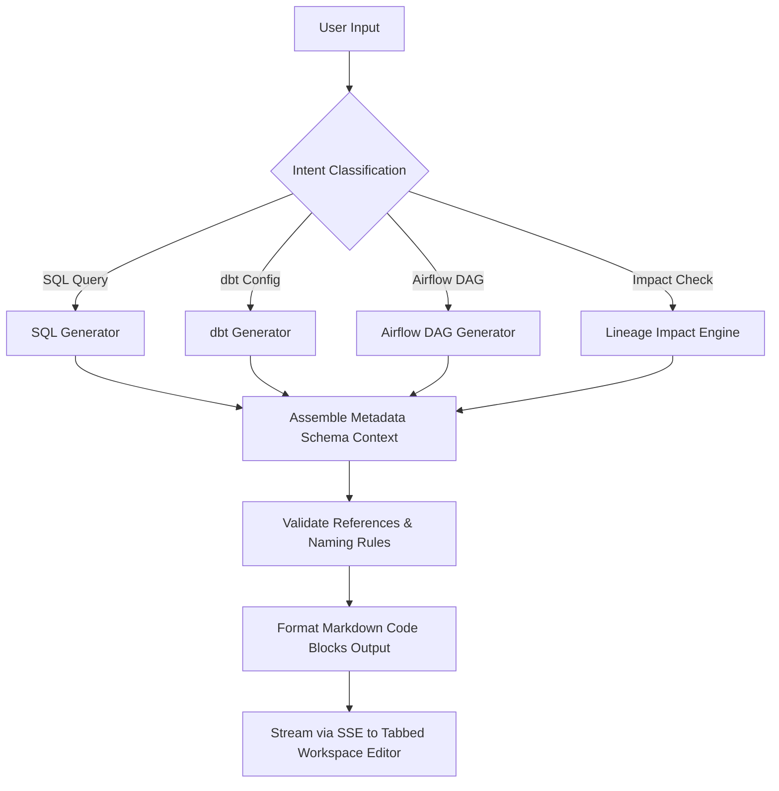

# MetaPilot AI Engineering Automation Platform - Guide

This document describes the architectural integrations and file structures for Phase 5 Engineering Automation in MetaPilot.

---

## 1. Engineering Automation Folder Structure

```
backend/app/ai/generators/
├── sql.py          # SELECT, JOIN, and DQ query builders
├── dbt.py          # schema.yml and source yaml config synthesizer
├── airflow.py      # python dag code builder using taskflow decorators
├── impact.py       # walks lineages downstreams and assigns risk ratings
├── root_cause.py   # checks errors triggers and advises corrective tasks
└── export.py       # packages text files into download-ready ZIP files
```

---

## 2. Multi-Stage Pipeline Generation Sequence



---

## 3. API Automation Endpoints

- **`POST /api/automation/generate`**:
  Accepts: `{"artifact_type": "sql|dbt|airflow|doc", "urn": "..."}`
  Returns: `{"files": {"schema.sql": "...", "schema.yml": "..."}}`
- **`GET /api/automation/export?artifact_type={type}&urn={urn}`**:
  Assembles files and returns binary `StreamingResponse` attachment package stream (ZIP format).
