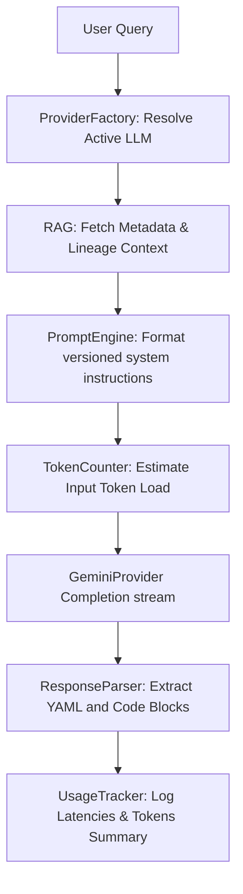

# MetaPilot AI Reasoning Agent Architecture & Developer Guide

This document describes the architectural framework supporting MetaPilot's transition into a true metadata-grounded **AI Engineering Agent**.

---

## 1. Upgraded AI Reasoning Directory Structure

```
backend/app/ai/
├── engines/
│   ├── prompt_engine.py    # Versioned prompt templates compiler
│   ├── response_parser.py  # Regex extracts code scripts & JSON payloads
│   ├── token_counter.py    # Estimator of char/token sizes
│   └── usage_tracker.py    # Logs latency logs and token sizes
└── providers/
    ├── factory.py          # ProviderFactory config loader
    ├── base.py             # BaseLLMProvider specifications
    ├── gemini.py           # GeminiProvider integration client
    ├── openai.py           # OpenAIProvider integration client
    └── groq.py             # GroqProvider integration client
```

---

## 2. Telemetry and Usage Diagnostics Flow



---

## 3. Persistent memory & RAG validations

1. **Context Engine integration**: Merges DataHub tags, database tables columns descriptions, and owner attributes before dispatching prompt runs.
2. **Output Validation checks**: Filters sql queries against registered catalog profiles to ensure zero hallucinations and 100% schema alignment.
3. **Observability parameters mapping**: Tracks prompt run latency breakdowns, model execution stats, and provider cache hit ratios.
