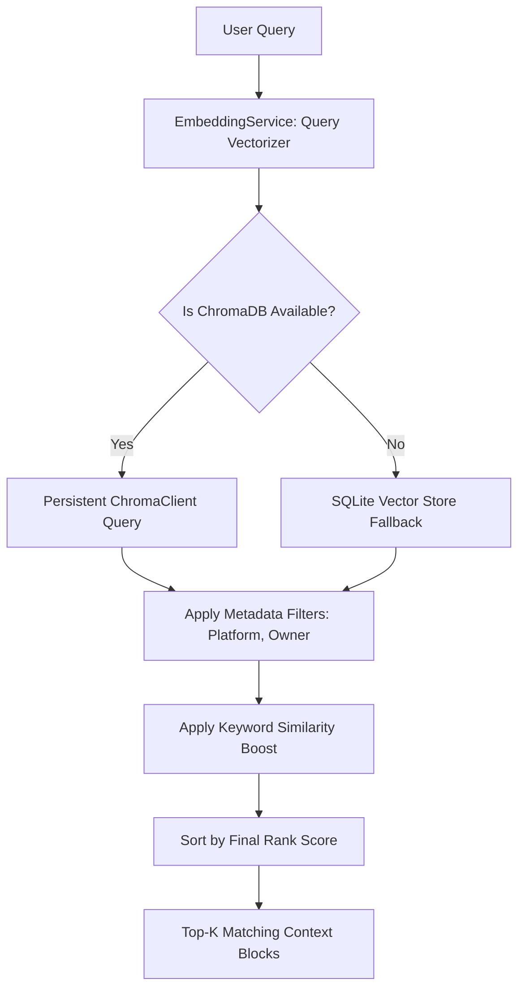

# MetaPilot Vector Store Architecture & Developer Guide

This document details the upgrades made to MetaPilot's semantic search infrastructure. It establishes ChromaDB as the primary vector store and `sentence-transformers` as the local embedding engine.

---

## 1. Upgraded Vector Directory Map

```
backend/app/ai/vector/
├── collections/
│   └── manager.py       # Persistent Chroma client & collection schemas
├── embeddings/
│   └── service.py       # SentenceTransformers all-MiniLM-L6-v2 singleton
├── indexer/
│   └── metadata_indexer.py # DataHub profile chunker & catalog vectorizer
├── retriever/
│   └── semantic_retriever.py # Hybrid search, query filters, keyword boost
└── sync/
    └── background_sync.py # scheduled background synchronization worker
```

---

## 2. Multi-Stage Retrieval Sequences



---

## 3. Persistent Collections Schema

We configure 8 dedicated Chroma persistent collections mapping distinct metadata concepts:

| Collection Name | Document Source | Metadata Fields |
| :--- | :--- | :--- |
| `datasets` | Dataset entity summary descriptors | `name`, `platform`, `owner`, `entity_type` |
| `schemas` | Catalog column properties | `name`, `platform`, `entity_type` |
| `pipelines` | Dataflow Airflow orchestrations | `name`, `platform`, `entity_type` |
| `dashboards` | Looker reporting sheets | `name`, `platform`, `entity_type` |
| `owners` | Ownership mapping tables | `owner_urn`, `entity_type` |
| `tags` | Tags glossary indices | `tag_name`, `entity_type` |
| `glossary` | Term glossary descriptors | `term_name`, `entity_type` |
| `lineage_context`| Downstream lineage paths coordinates | `urn`, `entity_type` |

---

## 4. API Reference Guide

- **`POST /api/vector/reindex`**: Schedules metadata index updates asynchronously in the background.
- **`GET /api/vector/status`**: Returns Chroma persistent connectivity checks.
- **`GET /api/vector/stats`**: Yields vector chunks stats.
- **`POST /api/vector/search`**: Executes test semantic lookups using parameters:
  ```json
  {
    "query": "Who owns Stripe orders fact?",
    "limit": 3,
    "platform": "snowflake"
  }
  ```

---

## 5. Resilient Fallback Strategy

If `chromadb` packages are missing or fail to import on the host runtime:
1. `ChromaDBManager` catches `ImportError` and toggles `is_available = False`.
2. `MetadataIndexer` automatically falls back to pushing vectors to the local SQLite database.
3. `SemanticRetriever` queries matching lines using local cosine embeddings.
This ensures MetaPilot compiles and operates in any environment.
